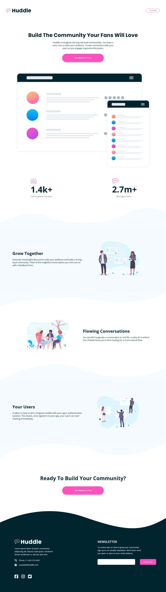
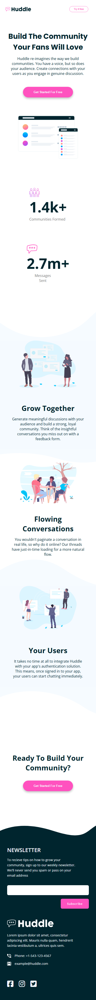

# Frontend Mentor - Huddle landing page with curved sections solution

This is a solution to the [Huddle landing page with curved sections challenge on Frontend Mentor](https://www.frontendmentor.io/challenges/huddle-landing-page-with-curved-sections-5ca5ecd01e82137ec91a50f2)

## Overview

### The challenge

This is a huddle landing page with curved sections master.

### Screenshot

## My process

### Built with

- CSS Grid
- CSS Flexbox
- Used local stored fonts, images & icons.
- Make website for phone responsive in external css file.

### What I learned

How to make a website device width friendly responsive where are so many section components.

### Continued development

If you continue your learning. You can gain more faster work experience for your upcoming projects.

## Author

- Frontend Mentor - [@sohanurshadhin](https://www.frontendmentor.io/profile/sohanurshadhin)
- Twitter - [@sohanurrshadhin](https://www.twitter.com/sohanurrshadhin)